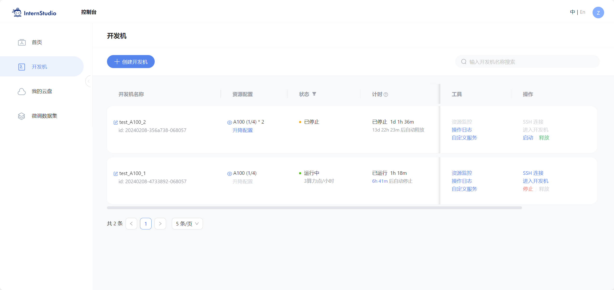
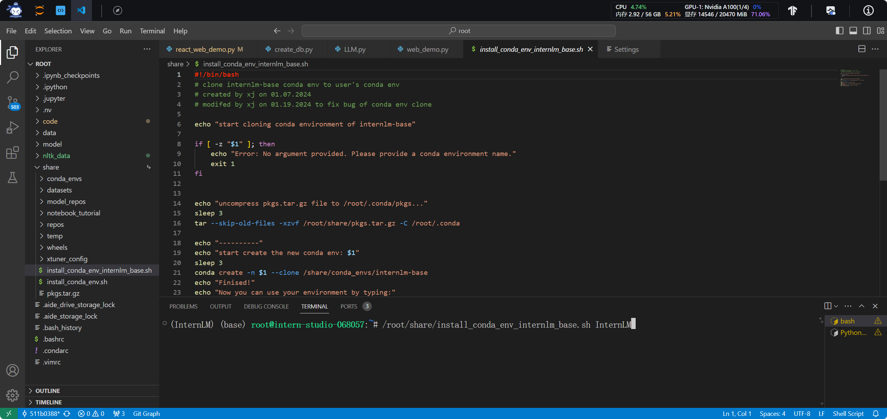
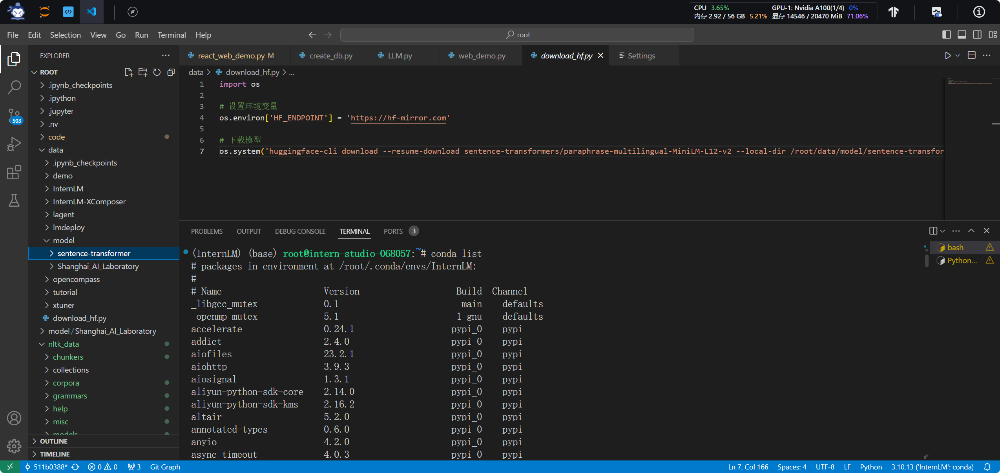
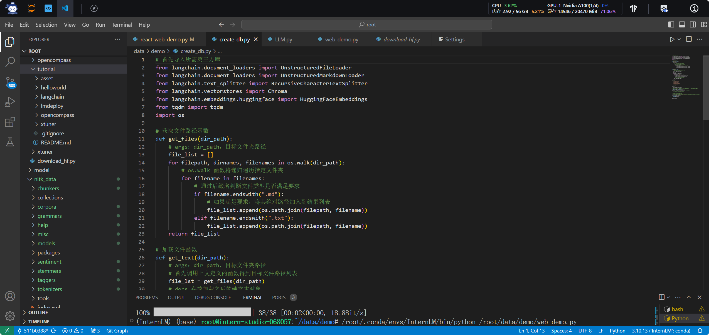
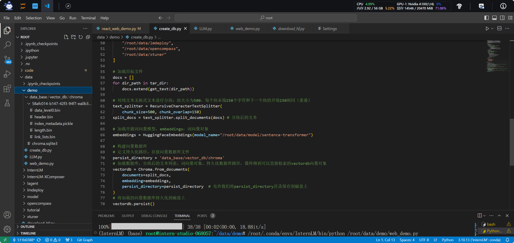
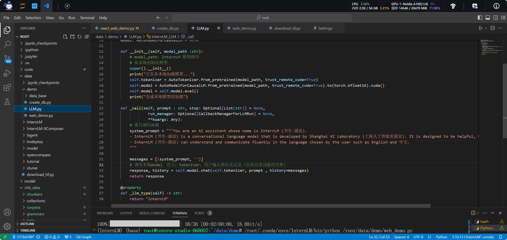
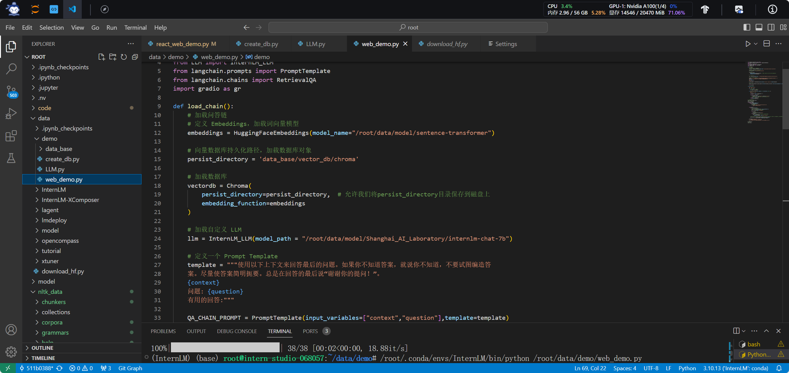
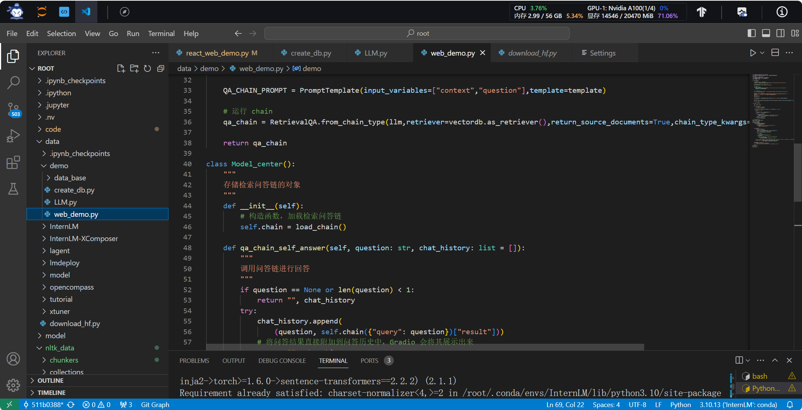
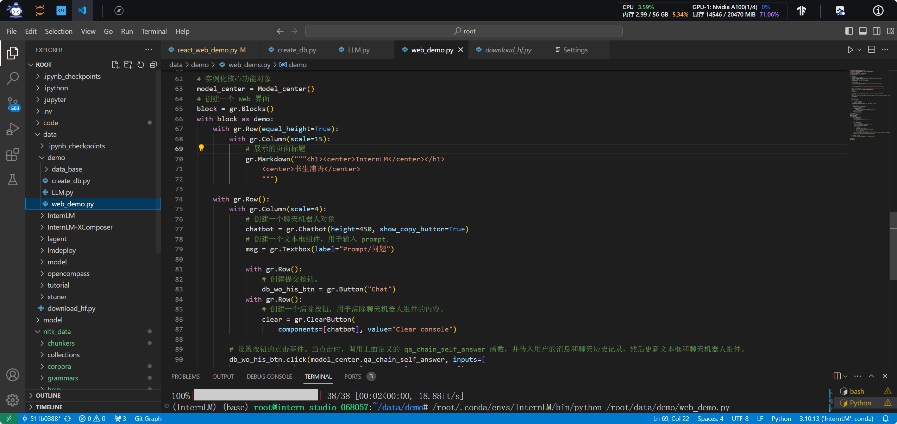
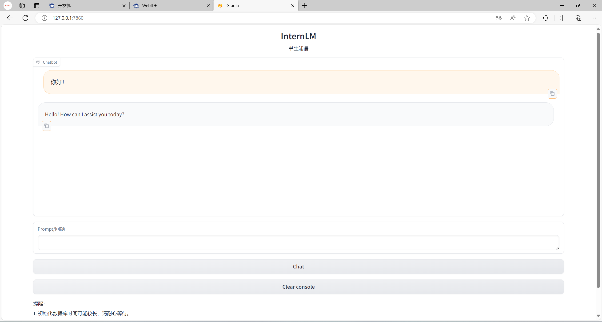

> # 第三讲 基于 InternLM 和 LangChain 搭建你的知识库 课后作业
> 
主讲人：邹雨衡
 
作业记录人：杨智凯
 
作业作答时间：2024.2.9

## 作业简介
作业与课堂实操内容紧密结合，完成本次作业不仅可以加深对课堂内容的理解，还可以提升实际操作能力，为实战营大作业做好准备，更好地掌握书生·浦语大模型的使用，了解大模型的训练、调用、部署等全流程相关知识。

本次作业主要是练习基于 InternLM 和 LangChain 搭建知识库的操作，包括模型调用、下载、部署等操作，以及对模型的理解和创作。

## 基础作业部分

### 复现课程知识库助手搭建过程 (需截图)
在课程中，我们学习了如何基于 InternLM 和 LangChain 搭建属于我们自己的知识库助手，总体流程如下：

- 1. 准备环境：安装所需的环境和工具
  - 开发机配置
  - conda环境配置
  - 模型下载
  - 构建问答链相关环境配置
  - 构建开源词向量环境配置
- 2. 知识库搭建
  - 搜集语料库并加载
  - 语料文本处理
  - 构建向量数据库
- 3. InterLM 接入 LangChain
  - 重写 InterLM 的问答接口
  - 构建检索问答链
    - 加载向量数据库
    - 实例化基于 InternLM 自定义的 LLM 对象
    - 构建检索问答链
- 4. 部署 Web 服务

下面将对各个环节的复现过程进行截图展示：

#### 1. 准备环境
首先，我们需要进入InternStudio并创建一个可供使用的开发机环境，此处，我选择参数为 GPU 为一个 A100(1/4) 的开发机，如下图所示：

进入开发机后，我们需要配置好 conda 环境并安装好本次作业中需要用到的包并指定可行的版本。利用课程提供的 conda 环境备份文件，我们可以快速地配置好环境，如下图所示：

随后便是复制模型文件 InternLM-7b、下载开源词向量模型 Sentence Transformer和有关于本项目的教程文件，如下图所示：

除了下载上述文件以外，为了提高项目执行便捷程度，又下载了运行时所需的NLTK相关资源以便运用。

#### 2. 知识库搭建
在知识库搭建环节，我们需要搜集语料库并加载，然后对语料文本进行处理。在前一个步骤中，我们已经下载了本课程的相关文档作为我们的语料库，随后问我们需要从本课程相关文件中提取出其中的文本文件，相关提取代码如下图所示：

随后，我们加载提取出的文本文件列表，使用LangChain提供的文本分块工具对文本进行处理（本次作业中分块大小为500，文本块的重叠大小为150）；完成分块后，我们使用LangChain提供的向量化工具接口导入开源词向量模型 Sentence Transformer 以对文本进行向量化；最终仅需确定好数据库文件路径、分块文档和向量化模型，就可利用Chroma提供的工具构建可用于LangChain的Chroma向量数据库，相关代码如下图所示：

#### 3. InterLM 接入 LangChain
在此环节中，我们首先需要编写自己的LLM类，即InternLM类，令其继承LangChain中的LLM类并重写相关的问答接口。在该类的初始化过程中，需要加载InternLM模型至LangChain中，此处载入的是InternLM-7B模型，随后重写相关调用函数，相关代码如下图所示：

完成接入后，便是构建我们自己的检索问答链。首先，需要加载前文中已经构建好的Chroma向量数据库；随后，实例化集成了LongChain LLM的InternLM对象；然后，借助LangChain中的工具，构建一个 Prompt Template 对象；相关代码如下图所示：

最后，构建检索问答链，将前面准备好的“原料”连成一条Q&A链，供调用使用，相关代码如下图所示：

#### 4. 部署 Web 服务
在本次作业中，使用的是Gradio Web服务。在网页中准备好一系列信息交互组件并完成相关配置，本次作业中我采用的是Gradio Web的默认配置，即运行于网页的 7860 端口，随后令本地与远端的 7860 端口连接便可实现网页的访问。

网页中用户的输入传入前面构建好的问答链中，再将问答链的输出结果返回呈现于网页，便完成了知识库的构建与展现。有关web的相关代码如下图所示：

最终网页效果如下图所示：

自此，便完成了基于 InternLM 和 LangChain 的整个知识库助手的搭建过程。

## 进阶作业部分

### 选择一个垂直领域，收集该领域的专业资料构建专业知识库，并搭建专业问答助手，并在 OpenXLab上成功部署（截图，并提供应用地址）

**整体实训营项目：**

时间周期：即日起致课程结束

即日开始可以在班级群中随机组队完成一个大作业项目，一些可提供的选题如下：

- 人情世故大模型：一个帮助用户撰写新年祝福文案的人情事故大模型
- 中小学数学大模型：一个拥有一定数学解题能力的大模型
- 心理大模型：一个治愈的心理大模型
- 工具调用类项目：结合 Lagent 构建数据集训练 InternLM 模型，支持对 MMYOLO 等工具的调用
- 其他基于书生·浦语工具链的小项目都在范围内，欢迎大家充分发挥想象力。
