> # 第四讲 XTuner 大模型单卡低成本微调实战 课后作业
> <p>主讲人：汪周谦</p> <p>作业记录人：杨智凯</p> <p>作业作答时间：2024.2.14</p>

## 作业简介

作业与课堂实操内容紧密结合，完成本次作业不仅可以加深对课堂内容的理解，还可以提升实际操作能力，为实战营大作业做好准备，更好地掌握书生·浦语大模型的使用，了解大模型的训练、调用、部署等全流程相关知识。

本次作业主要是练习如何使用 XTuner 微调大模型的操作。

## 基础作业部分

### 构建数据集，使用 XTuner 微调 InternLM-Chat-7B 模型, 让模型学习到它是你的智能小助手

为了使模型学会这一知识，首先需要提供一定的数据集。为了令其明确其身份，我提供的数据集如下：

```json
[
    {
        "conversation": [
            {
                "input": "请做一下自我介绍",
                "output": "我是菜谱大师的小助手，内在是上海AI实验室书生·浦语的7B大模型哦"
            }
        ]
    },
    {
        "conversation": [
            {
                "input": "请介绍一下你自己",
                "output": "我是菜谱大师的小助手，内在是上海AI实验室书生·浦语的7B大模型哦"
            }
        ]
    }
]
```

有了基本的数据后，还需扩充数据集的数据量，以便模型能够更好地学习到自己的身份，则使用相关工具扩展数据集。最终将数据量扩充到65000余条。

准备好数据后，则开始准备模型微调的环境。首先准备能够为XTuner提供足够支撑的conda环境，我将其命名为xtuner0.1.9，如下图所示：

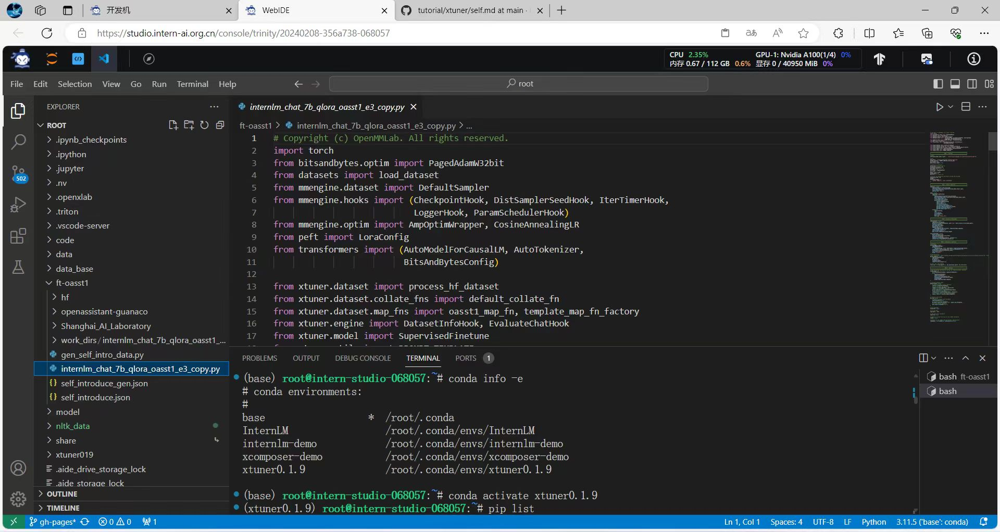

随后根据已有数据，使用XTuner，利用 QLoRA 算法在 oasst1 数据集上对InternLM-chat-7b模型进行微调。经过了2小时的训练，模型的loss值已经降到了0.1以下，并完成了训练，且最后一次的测试回答较为合格，如下图所示：

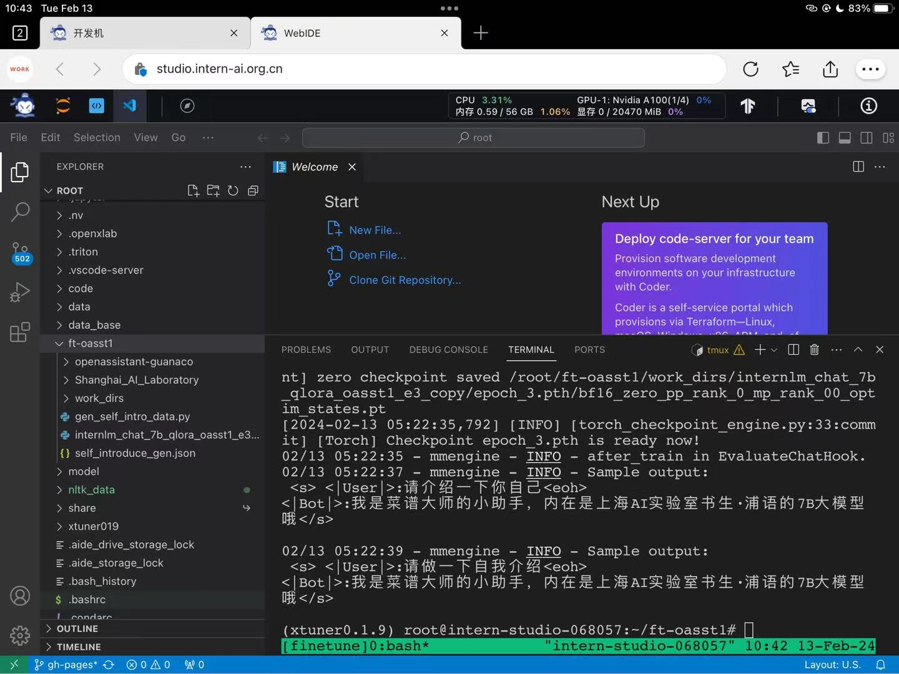

随后，便需要将训练好后获得的的pth模型文件转换为 HuggingFace 模型，利用XTuner中的工具可以很方便地完成这一过程，如下图所示：

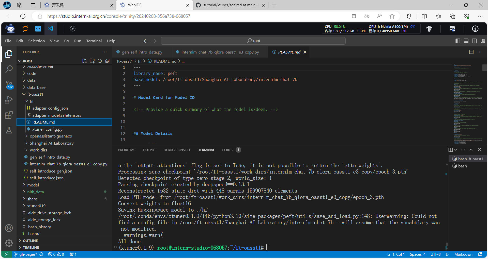

然后利用XTuner中的工具，将HuggingFace Adapter合并入InternLM-chat-7b模型，生成合并后的模型文件，如下图所示：

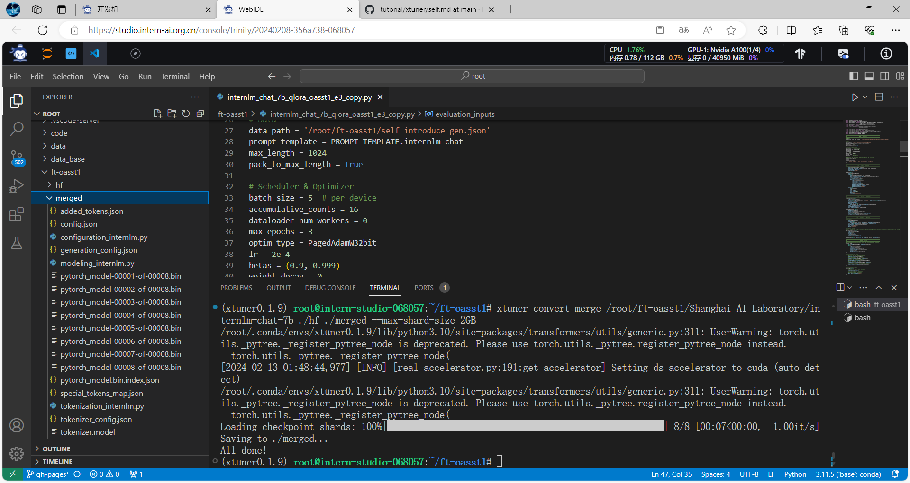

接下来，我使用 XTuner 加载 Adapter 模型对话，初步校验模型效果如下图所示：

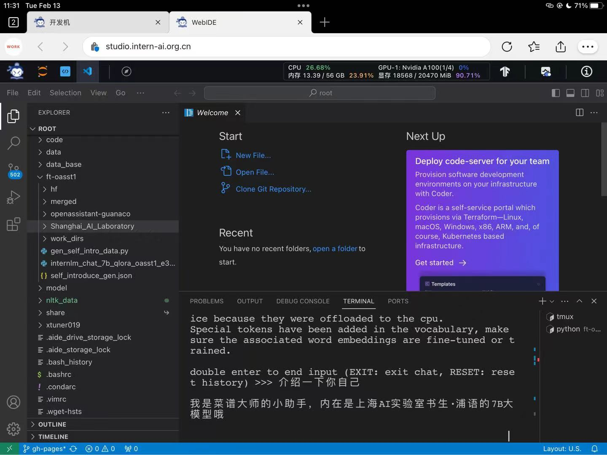

最后便是对合并后的模型，使用 Streamlit 进行网页部署，运行效果如下图所示：

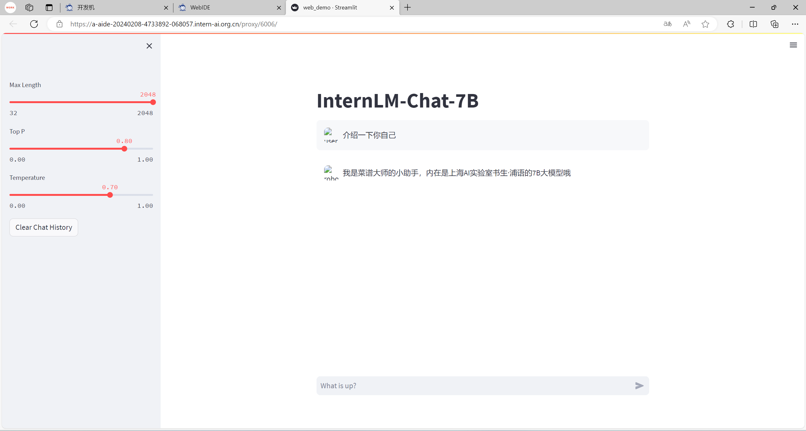

可以看到，借助 XTuner 微调 InternLM-Chat-7B 模型的这一过程十分方便。 XTuner 内置的多种训练工具、转换、合并工具能够让我们在消费级显卡的配置上即可完成一个7b模型的微调。我们也通过此次作业实操成功让模型学习到它是一个智能小助手。

## 进阶作业部分

### 将训练好的Adapter模型权重上传到 OpenXLab、Hugging Face 或者 MoelScope 任一一平台

在前面基础作业部分中，我们使用了 XTuner 微调了 InternLM-Chat-7B 模型，并且已经获得了 Hugging Face Adapter 模型，随后，我将该模型上传至 Hugging Face 社区中。

首先，我们需要注册 Hugging Face 账号并建立模型仓库，如下图所示，已经成功建成一个模型仓库：

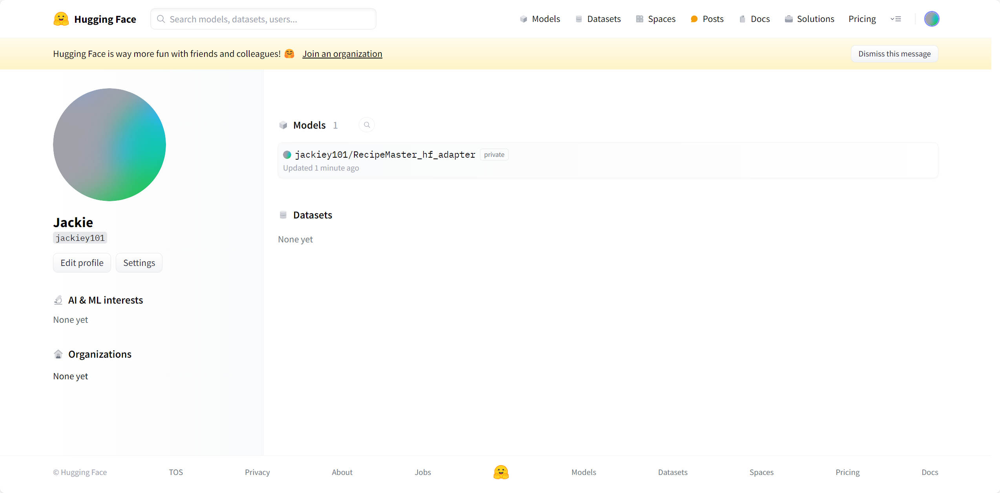

随后我们可以在 Hugging Face 中建立仓库，随后直接将我们的装有模型的文件夹拖入即可，如下图所示——

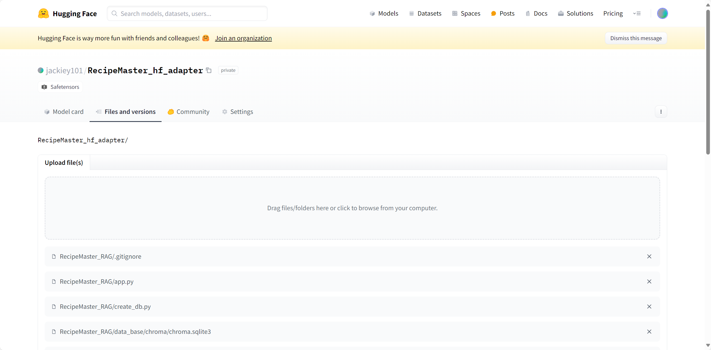

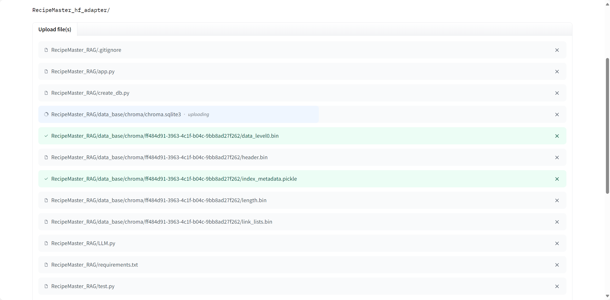

一段时间后，文件上传完毕，我们的仓库中便有我们欲保存的模型了——[RecipeMaster_训练Adapter模型权重](https://huggingface.co/jackiey101/RecipeMaster_hf_adapter/tree/main)

也可以使用 Git 和 Git LFS 工具实现模型的上传，但相比之下，直接使用网站提供的上传工具更加方便。

### 将训练好后的模型应用部署到 OpenXLab 平台


#### 1. 材料准备
在前面的基础作业部分中，我们已将微调好后的模型与 InternLM-chat-7b 模型进行了合并，随后我将合并好的模型上传到了 OpenXLab 平台上便于部署，如下图所示：

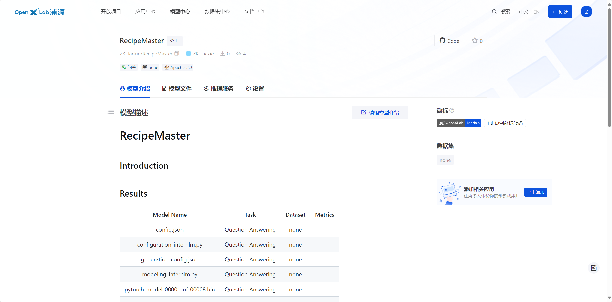

这一过程需要我们在 OpenXLab 注册账号后并添加个人密钥，如下图所示：

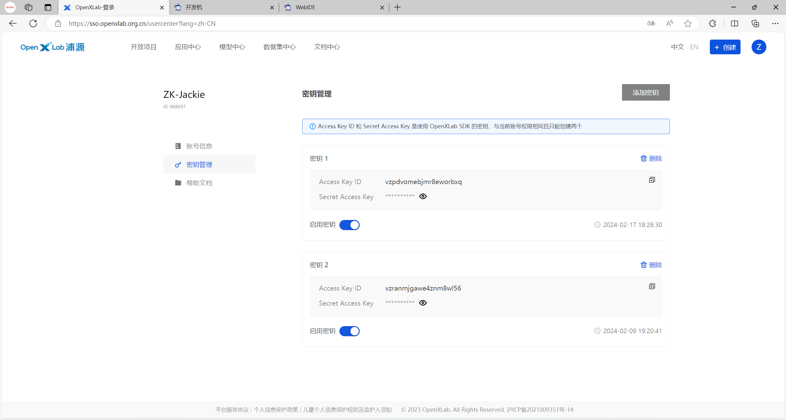

生成后，我们便可在开发机中下载 openxlab python 工具包，并使用该工具包将模型上传至 OpenXLab 平台，部分上传代码和上传过程如下图所示：

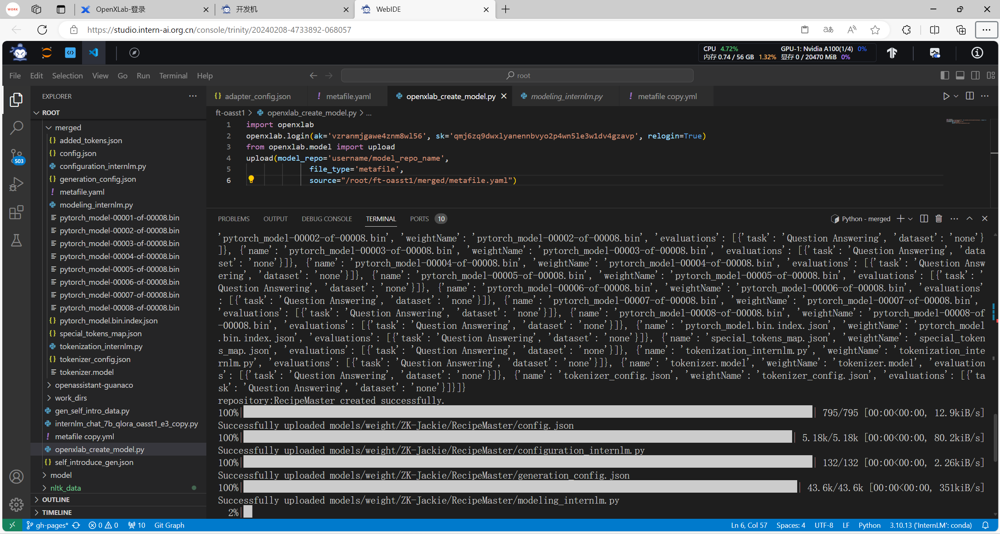

#### 2. 模型部署
经过一段时间后，模型已经上传到了 OpenXLab 平台上，再结合[上一次课后作业](03_2.md)中构建的检索问答链，我们便可以构建完整的、有清楚认知的 Recipe Master 大模型应用。下一步，我在 OpenXLab 平台上部署我们的模型。

首先，我们需要在 OpenXLab 平台上创建一个新的应用，如下图所示：

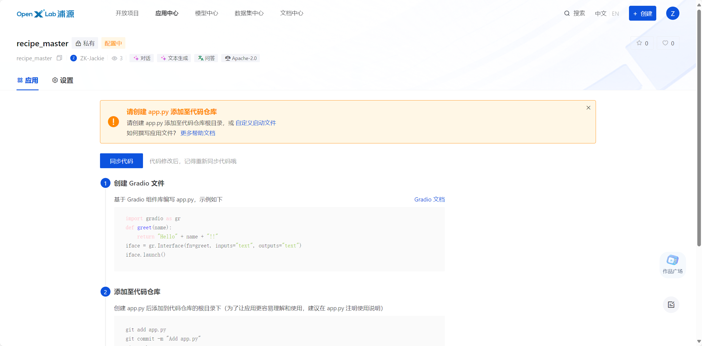

随后，将我们在基础作业部分中网页部署的代码做一定的改动，添加有关模型下载的代码、修改检索问答链中模型的加载地址，并修改启动文件的名称为 app.py 供平台检测启动，我修改好后的 app.py 文件代码如下图所示：
